# Broadcast Sizing

BROADCASTSIZING

## What it is

A join has two ways to move data. The [shuffle join](#joins) forces all-to-all traffic across the
cluster; the broadcast join ships one side out to every executor and skips the [shuffle](#shuffle)
entirely. `spark.sql.autoBroadcastJoinThreshold` is the size gate that picks between them:
it sets the largest table, in bytes, that Spark will broadcast when planning a join, and it
defaults to 10 MB.[^1][^2] Set it to `-1` and automatic broadcasting is off, so Spark always
shuffles.[^1]

Given a join's estimated table sizes and that gate, there are two ways the choice can
go wrong:

- **underBroadcast**: one side is small enough to broadcast but is being shuffled anyway. The
  join pays for an all-to-all exchange it could have avoided.
- **overBroadcast**: a side that is too large is being broadcast, which risks running the
  driver or the executors out of memory.

## How it's detected

Each join carries an estimated size for the side in question, which is compared against
the broadcast threshold:

| Finding | Condition | What it means |
|---|---|---|
| `underBroadcast` | small side is being shuffled instead of broadcast | a cheap broadcast join was left on the table |
| `overBroadcast` | an oversized side is being broadcast | the broadcast is a memory hazard |

## Why it matters

Broadcasting the small side sends a full copy of that table to every executor. It pays off
only when network bandwidth and executor memory are not the bottleneck; there, it is far cheaper
than the shuffle it replaces.[^3] That is the cost an `underBroadcast` finding is
pointing at: a small dimension going through an all-to-all exchange when a copy on each
executor would have run fast.

`overBroadcast` is the opposite mistake, and it fails hard. Pushing a table that is too large
through the broadcast path breaks in two ways: too-large task result errors and out-of-memory
failures, both because the oversized table has to be collected on the driver and shipped whole
to every executor.[^4] The size gate exists for exactly this reason: a copy on every executor is
harmless for a small table and a memory hazard for a large one.

## How to fix it

For `underBroadcast`, let the small side broadcast. If its estimated size sits above the 10 MB
default but still fits comfortably in executor memory, raise
`spark.sql.autoBroadcastJoinThreshold` to cover it, or force the strategy with `broadcast(df)`
on the small side.[^1][^5]

For `overBroadcast`, keep the large side out of the broadcast path. Lower the threshold so the
oversized table no longer qualifies, or drop the explicit `broadcast()` hint if one is forcing
it, and let Spark fall back to a shuffle join.

## Confidence

Validated for both branches. `underBroadcast` and `overBroadcast` rest on the same
well-documented mechanism: the broadcast threshold and its two failure modes are standard Spark
behavior, so neither branch is experimental.

## Limitations / false-positive risk

The comparison is only as good as the size estimate behind it. Table sizes come from
statistics that may be stale or missing, so a join that looks mis-sized can be measuring the wrong number. A
large broadcast can also be deliberate: an operator who has sized executor memory for it may
broadcast a table well past the default on purpose.

[^1]: [Configuration (Spark)](https://spark.apache.org/docs/latest/configuration.html)
[^2]: [Performance Tuning (Spark SQL, DataFrames and Datasets Guide)](https://spark.apache.org/docs/latest/sql-performance-tuning.html)
[^3]: *Learning Spark, 2nd Edition*, Damji, Wenig, Das, Lee, ch. 7
[^4]: *High Performance Spark, 2nd Edition*, Karau, Polak & Warren, ch. 6
[^5]: [The Apache Spark Optimization Checklist](https://luminousmen.com/post/the-apache-spark-optimization-checklist)
