# Retry Waste

<span class="tag">RETRY</span>

## What it is

When a task attempt is superseded by a later retry, every bit of executor time the abandoned
attempt spent counts for nothing. Every attempt, successful or not, accrues the standard task
metrics: `executorRunTime` ("elapsed time the executor spent running this task," including
time fetching shuffle data) and `executorCpuTime`[^1], but only the winning attempt's output
survives. The TaskScheduler is what triggers the do-over: "if an executor dies or a task throws
an exception, the TaskScheduler resubmits the task to another executor, respecting Spark's task
locality preferences"[^2]. Whatever the discarded attempt had already run is gone; none of it
carries forward into the job's result.




## How it's detected

A stage's superseded task attempts are the signal: a later retry supersedes an earlier attempt
after [an executor is lost](#bottleneck-failures) (`ExecutorLostFailure`) or after a shuffle `FetchFailed`, since "if an
executor dies or a task throws an exception, the TaskScheduler resubmits the task to another
executor, respecting Spark's task locality preferences"[^2]. Because only the winning attempt's
output survives, the abandoned attempt's `executorRunTime` (the elapsed executor time defined
above) is the wasted time.

The two causes are handled differently by Spark's own machinery, which is how they can be told
apart after the fact. An `ExecutorLostFailure` removes the executor (and any shuffle map output
it had already written) from the pool outright[^3]. A shuffle `FetchFailed`, by contrast, is a
read-side failure against a still-alive remote executor, and Spark's own exclusion machinery
treats it as a distinct category from a general executor loss:
`spark.excludeOnFailure.killExcludedExecutors` governs whether Spark kills executors "excluded
on fetch failure or excluded for the entire application"[^4], a separate bucket from executor
loss in Spark's accounting. That distinction (executor-loss bucket vs. fetch-failure bucket)
is the basis for identifying which cause dominated a given stage's retry waste.

## Why it matters

A lost executor can waste more than just the in-flight task's time: "dynamic allocation may
remove an executor before the shuffle completes, in which case the shuffle files written by that
executor must be recomputed unnecessarily"[^3], so prior map-output work from that same executor
may need redoing too. A `FetchFailed` doesn't carry that same risk, since the remote executor
stays alive and only the one failed read is lost[^4].

## How to fix it

- Check the retried-attempt count and accumulated `executorRunTime`/`executorCpuTime` on the
  abandoned attempts directly, rather than trusting the stage's final wall-clock duration:
  a clean-looking stage can still be hiding significant wasted compute[^1].
- If the dominant cause is executor loss, investigate node-level stability (OOM-kills, node
  death, aggressive dynamic-allocation deallocation) rather than the task logic itself, since
  the lost executor's prior shuffle-write work may also need recomputing[^3].
- If the dominant cause is `FetchFailed`, check whether `spark.excludeOnFailure.killExcludedExecutors`
  is causing repeated exclusion churn on otherwise-live executors, and treat it separately from
  outright executor loss[^4].
- See also [job failure rate](#bottleneck-job-failure-rate): retry waste can pile up quietly on
  a job that ultimately succeeds, while the same underlying causes (exhausted at a higher
  threshold) are what push a job to fail outright.

> **PySpark:** there's no attempt-level API to recover a discarded attempt's `executorRunTime`:
> pull it from the event log or history server UI's per-stage task list, filtering for tasks
> whose attempt number is greater than zero.

The preventive lever: keep an executor's shuffle output available if it is lost, so retries don't recompute prior map work[^5]:

```properties
spark.dynamicAllocation.shuffleTracking.enabled=true
```

## Limitations / false-positive risk

Some retry waste is unavoidable: transient cluster faults will always cost a few
superseded attempts, and no tuning drives that to zero. The metric attributes burned
executor time to the abandoned attempts, so its accuracy tracks the failure cause. When
a lost executor also forces recompute of prior map output, the per-attempt
`executorRunTime` undercounts the true cost; when an attempt fails almost immediately, it
overcounts the compute actually lost. Read the number as a directional signal, not an
exact ledger.

## Related

- **Shuffle recompute on executor loss:** [Shuffle](#shuffle)
- **Executor stability & dynamic allocation:** [Cluster Tuning](#cluster-config)

[^1]: [Monitoring and Instrumentation](https://spark.apache.org/docs/latest/monitoring.html)
[^2]: [Spark: Anatomy of Spark Application](https://luminousmen.com/post/spark-anatomy-of-spark-application)
[^3]: [Job Scheduling (Spark)](https://spark.apache.org/docs/latest/job-scheduling.html)
[^4]: [Configuration (Spark)](https://spark.apache.org/docs/latest/configuration.html)
[^5]: [Configuration (Spark)](https://spark.apache.org/docs/latest/configuration.html)
