# Memory / Disk Spill

<span class="tag">SPILL</span>

## What it is

Spill happens when a task's share of execution memory runs out during a sort or hash
aggregation. Each task gets its own `TaskMemoryManager`, which arbitrates the shared execution
pool across every task running concurrently on an executor; with `n` tasks running
concurrently, each is allowed to allocate somewhere between `1/(2n)` and `1/n` of total
execution memory: a soft limit, not a hard stop.[^1] When a task's sort or hash-aggregation
operator keeps requesting execution-memory pages it can't get, Spark doesn't fail immediately:
it blocks the requesting task, triggers a spill of that task's in-memory data structure to
disk, or, in the worst case, throws an `OutOfMemoryError`.[^1]

The spill path runs through Spark's map/shuffle I/O machinery: shuffle partitions created by
wide transformations like `groupBy()` or `join()` spill to the executors' local disks, at the
location set by `spark.local.directory`.[^2] SQL physical operators apply the same idea with
their own guardrails: `SortMergeJoinExec`'s in-memory buffer and the cartesian-product
operator's buffer both spill once they cross a configured row-count threshold, which by
default is `spark.shuffle.spill.numElementsForceSpillThreshold`.[^3] Whatever the trigger, the
resulting spilled bytes are exposed on the task metrics as `memoryBytesSpilled`, visible in the
Spark UI and event log.[^4]

## How it's detected

Detection: any `memoryBytesSpilled > 0` → Warning. The classification is the actionable
signal.

Spill classification:
- `skew`: ≥ 80% of tasks have zero spill; fix: address [task skew](#bottleneck-skew), not memory.
- `volume`: < 20% of tasks have zero spill; fix: more partitions or more memory.
- `unclassified`: neither condition; treat as volume.




## Why it matters

Spill is the fallback Spark reaches for once a task can no longer get the execution memory
it's asking for: rather than failing outright, it blocks the task, writes its buffered data to
disk, or (if that's not enough) throws an `OutOfMemoryError`.[^1] A task that's spilling has
already given up pure in-memory speed to keep running at all, which is why the skew-vs-volume
split above is the actionable part of the signal: the two failure shapes call for opposite
fixes.

## How to fix it

- **Skew**: When only a few tasks spill, the problem is the shape of the data, not the size
  of the memory pool. `repartition()` is the tool for this: reach for it specifically to fix a
  lopsided partition distribution or to increase partition count[^5], in contrast to
  `coalesce()`, which never rebalances skewed data because it just stacks existing partitions
  together: partitions that were uneven going in are still uneven coming out.[^6] For skewed
  joins, [Adaptive Query Execution](#aqe) can detect and split[^9] oversized partitions automatically: a
  partition counts as skewed once it's larger than
  `spark.sql.adaptive.skewJoin.skewedPartitionFactor` (default `5.0`) times the median
  partition size, and also larger than
  `spark.sql.adaptive.skewJoin.skewedPartitionThresholdInBytes` (default `256 MB`).[^7][^8]
  Before AQE existed, the manual equivalent was salting: adding a prefix to the skewed keys to
  make the same key look different, then adjusting the data distribution accordingly.[^9]
  Databricks' `/*+ SKEW(...) */` hint lets you name the skewed relation and specific key values
  directly, so the planner targets just those keys instead of relying on automatic
  detection.[^10]
- **Volume**: When most tasks spill, the fix is more room to work with: more partitions, more
  memory, or both. `repartition(n)` guarantees exactly `n` output partitions via a hash
  shuffle[^11], and since Spark's per-task startup overhead is low (unlike MapReduce's), the
  general bias is to err toward more partitions rather than fewer.[^12]
  `spark.sql.files.maxPartitionBytes` (default `128 MB`) is the equivalent lever on the input
  side, governing how much file data gets packed into each input partition before a shuffle
  even happens.[^6] On the memory side, execution memory is a fraction of the JVM heap.
  `spark.memory.fraction` (default `0.6`) sizes the shared execution/storage region as
  `(JVM heap − 300 MiB) × spark.memory.fraction`[^13]. Because each task's slice of that
  region is capped by the `TaskMemoryManager` at between `1/(2n)` and `1/n` of the total,[^1]
  giving executors more memory, or running fewer concurrent tasks on each one, directly raises
  the ceiling before spill kicks in.

For the **volume** case, give tasks more room: defaults shown, comments say which way to move:

```properties
# Create more, smaller input partitions before the shuffle (default 128m)
spark.sql.files.maxPartitionBytes=128m

# Execution/storage share of (JVM heap - 300MiB) (default 0.6);
# raising it grows execution memory but starves the untracked user-memory region
spark.memory.fraction=0.6
```

For the **skew** case (only a few tasks spill), the fix is `df.repartition(n)`, not more memory: see [Partitioning](#partitioning).

## Confidence

The core detection (any `memoryBytesSpilled > 0`) and the skew-vs-volume classification are validated: both the skew branch (most tasks spill nothing, so the shape of the data is the problem) and the volume branch (nearly every task spills, so the pool is too small) map to a well-understood fix, and neither needs further validation. <span class="tag">EXPERIMENTAL</span> When a spill matches neither shape, it falls back to a low-confidence unclassified finding that still requires validation, because there is no confirmed cause to act on; the page defaults it to the volume remedy, but that is a guess, not a diagnosis.

## Limitations / false-positive risk

Some spill is normal. A large aggregation or join can spill by design once its working set outgrows execution memory, and a small spill on a healthy stage rarely repays the effort of chasing it. The raw `memoryBytesSpilled > 0` trigger fires on both the actionable and the routine cases, so treat a small spill as informational until the skew-vs-volume split says otherwise.

## Related

- **Why it happens:** [Memory Management](#memory-model), [Partitioning](#partitioning)

[^1]: [Diving into Spark Memory Management](https://luminousmen.com/post/dive-into-spark-memory)
[^2]: *Learning Spark, 2nd Edition*, Damji, Wenig, Das, Lee, ch. 7
[^3]: [SQLConf.scala](https://raw.githubusercontent.com/apache/spark/v3.5.0/sql/catalyst/src/main/scala/org/apache/spark/sql/internal/SQLConf.scala)
[^4]: [Monitoring and Instrumentation](https://spark.apache.org/docs/latest/monitoring.html#spark-history-server)
[^5]: *Spark: The Definitive Guide*, Chambers & Zaharia, ch. 19
[^6]: [Spark Partitions](https://luminousmen.com/post/spark-partitions)
[^7]: [Configuration (Spark)](https://spark.apache.org/docs/latest/configuration.html)
[^8]: [Performance Tuning (Spark SQL, DataFrames and Datasets Guide)](https://spark.apache.org/docs/latest/sql-performance-tuning.html)
[^9]: [SPARK-29544: Optimize Skewed Join in SQL Adaptive Execution](https://issues.apache.org/jira/browse/SPARK-29544)
[^10]: [Skew Join Optimization](https://docs.databricks.com/aws/en/archive/legacy/skew-join)
[^11]: [RDD.scala](https://raw.githubusercontent.com/apache/spark/v3.5.0/core/src/main/scala/org/apache/spark/rdd/RDD.scala)
[^12]: [How to Tune Your Apache Spark Jobs (Part 2): Cloudera Engineering Blog](https://blog.cloudera.com/how-to-tune-your-apache-spark-jobs-part-2/)
[^13]: [Spark Tuning Guide](https://spark.apache.org/docs/latest/tuning.html)
