# Executor Utilization

<span class="tag">UTIL</span>

## What it is

Executor utilization measures how much of the cluster's allocated executor capacity a job actually keeps busy. When the average number of active executors trails the peak number allocated, the cluster is holding compute (cores and memory) that isn't running any tasks.

## How it's detected

The signal is the ratio of average active executors to the peak active executor count observed over the job's lifetime:

| avg active executors / peak | Level |
|---|---|
| < 60% | Info |
| < 40% | Warning |
| < 20% | Critical |

## Why it matters

Idle executors are allocation you're paying for without getting work done. One common cause is too little task parallelism to occupy the allocated cores: the guidance is to keep at least as many partitions as there are cores across the executors, so no core sits idle[^1]. Parallelism can also be lost by accident rather than by under-partitioning upfront: because `coalesce` is a narrow transformation, reducing partition count with it forces the *entire* upstream stage down to the reduced parallelism, not just the coalesce step, trading a shuffle for lost concurrency[^2]. Separately, under dynamic allocation, a workload with many small tasks can end up over-provisioned: by default it requests enough executors to maximize parallelism for the task count, and with small tasks that can mean some executors "might not even do any work," wasting resources on allocation overhead[^3].

## How to fix it

- Reach for `repartition` (not `coalesce`) when you need to raise partition count or rebalance data: `coalesce` only avoids a shuffle when shrinking partition count, and doing so also drags the entire upstream stage down to the reduced parallelism[^4][^2].
- Size partitions so the task count is at least the core count available across executors, to avoid leaving cores idle[^1].
- Under dynamic allocation, lower `spark.dynamicAllocation.executorAllocationRatio` below its default of `1.0` to scale back the number of executors requested for workloads made up of many small tasks[^3].
- Dynamic allocation requires shuffle tracking, the external shuffle service, or shuffle-block decommissioning to be enabled as a precondition[^3]; without one of them, an executor removed mid-shuffle takes its unfetched shuffle files with it, forcing a recompute[^5], which undercuts using dynamic allocation to shed idle executors in the first place. `spark.dynamicAllocation.shuffleTracking.enabled` defaults to `true` since Spark 3.0, satisfying that precondition without needing a separate external shuffle service[^3].

Restore parallelism after a heavy filter, and rein in over-provisioning for many-small-task jobs:

```python
# repartition (not coalesce) rebalances and can raise partition count; aim >= total executor cores
df = df.filter(heavy_predicate).repartition(spark.sparkContext.defaultParallelism)

# Scale back executors requested for many-small-task workloads (default ratio 1.0)
spark.conf.set("spark.dynamicAllocation.executorAllocationRatio", "0.5")  # 0.5 is an example
```

## Limitations / false-positive risk

A low average-to-peak ratio isn't always waste. A bursty or I/O-bound job legitimately holds executors while tasks wait on external systems rather than burning cores, and the ratio is sensitive to short stages, where a brief spike in allocation skews the average without meaning the cluster was genuinely idle.

## Caching opportunity

<span class="tag">CACHE</span>

When the same DataFrame, RDD, or input is scanned more than once, low utilization can trace back to repeated recomputation rather than idle cores. Spark keeps nothing between actions: transformations only build a DAG, and once an action finishes its intermediate results are discarded[^6]. Call a second action on the same logic and Spark re-runs the whole DAG from the source, which can mean re-reading a terabyte from S3, re-reading Kafka, or repeating expensive decompression[^6]. Fork that logic into two pipeline branches and you sign up to recompute everything twice[^6].




[`cache()` and `persist()`](#caching) are how you stop that. Persisting materializes the RDD (usually in memory on the executors) so it can be reused within the job, while Spark keeps its lineage to recompute any lost partition[^7]. For a dataset you read repeatedly, this is one of the most useful optimizations available: it parks a DataFrame, table, or RDD in temporary storage across the executors and makes later reads fast[^8]. Materialization is lazy and per-block, so only an action that touches every partition (`count()` or a full write) caches all of it; a subset scan like `take(10)` leaves a partial cache[^6].

`cache()` is shorthand; `persist()` takes a `StorageLevel` and lets you pick the tradeoff:

| Level | Tradeoff |
|---|---|
| `MEMORY_ONLY` | Fastest reads (deserialized JVM objects), but partitions that don't fit are recomputed on the fly each time[^8]. |
| `MEMORY_AND_DISK` | Spills the overflow to disk instead of recomputing; Spark's default caching strategy and fine for most pipelines[^9]. For DataFrames, `.cache()` maps to this[^6]. |
| Serialized (`_SER`) | Byte arrays instead of raw objects: smaller footprint, slower reads. Reach for it when memory is tight[^9]. |
| Replicated (`_2`) | A second copy for fast fault recovery instead of waiting on recomputation, at twice the space[^10][^9]. |

Whether to spill to disk hinges on recomputation cost: reading a block back from disk only beats recomputing it when the work that produced the data is expensive or filters out a large fraction, so the RDD guide says don't enable disk otherwise[^10].

Caching is not free, and several cases don't warrant it:

- **Single use.** Caching adds serialization, deserialization, and storage cost, so caching data you read once only slows you down[^8].
- **Data larger than storage memory,** or a cheap transformation that isn't reused often regardless of size[^11].
- **Memory pressure.** Cache memory is memory taken from processing, and under the default spill strategy cached data can land on slower disk, so caching can cost more than just re-reading the source[^9].
- **Lost optimizer freedom.** Once a dataset is cached, Catalyst works on the in-memory copy and can no longer push filters down to the source[^9].

A persisted RDD you've stopped using still occupies memory until the app ends or eviction forces it out, so call `unpersist()` to reclaim it deliberately, which matters most on shared clusters[^9].

## Related

- **Task parallelism:** [Partitioning](#partitioning)
- **Executor sizing:** [Cluster Tuning](#cluster-config)

[^1]: *Learning Spark, 2nd Edition*, Damji, Wenig, Das & Lee, ch. 7
[^2]: *High Performance Spark, 2nd Edition*, Karau, Polak & Warren, ch. 8
[^3]: [Configuration — Spark](https://spark.apache.org/docs/latest/configuration.html)
[^4]: *Spark: The Definitive Guide*, Chambers & Zaharia, ch. 19
[^5]: [Job Scheduling — Dynamic Resource Allocation](https://spark.apache.org/docs/latest/job-scheduling.html)
[^6]: [Explaining the Mechanics of Spark Caching](https://luminousmen.com/post/explaining-the-mechanics-of-spark-caching)
[^7]: *High Performance Spark, 2nd Edition*, Karau, Polak & Warren, ch. 2
[^8]: *Spark: The Definitive Guide*, Chambers & Zaharia, ch. 19
[^9]: [Spark Tips: Caching](https://luminousmen.com/post/spark-tips-caching)
[^10]: [RDD Programming Guide — Spark](https://spark.apache.org/docs/latest/rdd-programming-guide.html)
[^11]: *Learning Spark, 2nd Edition*, Damji, Wenig, Das & Lee, ch. 7
